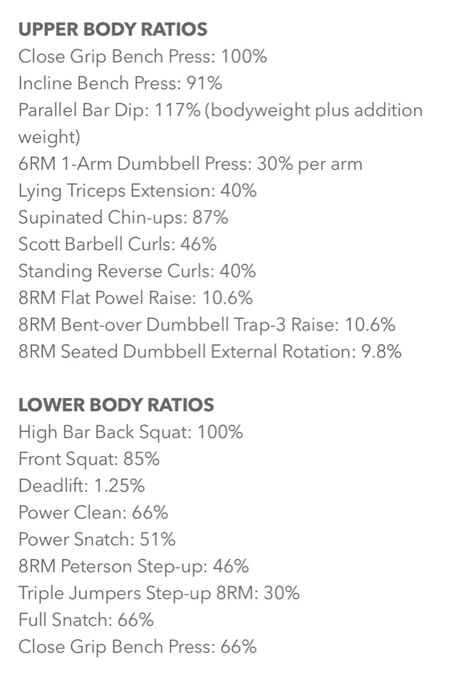

# Poliquin Structural Balance Calculator

This project provides a Python-based calculator for evaluating structural balance in strength training. The calculator takes input values for Close Grip Bench Press and High Bar Back Squat to calculate corresponding ratios for various other exercises. The aim is to help athletes and coaches maintain structural balance and optimize training programs.

## Description

The Poliquin Structural Balance Calculator helps in assessing the strength balance across different exercises based on the ratios provided by Charles Poliquin. The user inputs their maximum lifts for the Close Grip Bench Press and High Bar Back Squat, and the calculator outputs the recommended weights for a variety of upper and lower body exercises.

## Features

- **Input**: Maximum weights for Close Grip Bench Press and High Bar Back Squat.
- **Output**: Recommended weights for other exercises based on Poliquin's ratios.

## Usage

1. Clone the repository:
    ```bash
    git clone https://github.com/rlvae/Poliquin-Structural-Balance-Calculator.git
    cd Poliquin-Structural-Balance-Calculator
    ```
2. Run the Python script:
    ```bash
    python Poliquin_Structural_Balance_Calculator.py
    ```

3. Enter the required values when prompted:
    - Close Grip Bench Press (kg)
    - High Bar Back Squat (kg)

4. The script will output the recommended weights for various exercises.

## Example

Here is an example of the input and output from the calculator:


    **Enter the Close Grip Bench Press weight (kg): 100**
    **Enter the High Bar Back Squat weight (kg): 150**

- Incline Bench Press: 91.0 kg
- Parallel Bar Dip: 117.0 kg
- 1-Arm Dumbbell Press (per arm): 30.0 kg
- Lying Triceps Extension: 40.0 kg
- Supinated Chin-ups: 87.0 kg
- Scott Barbell Curls: 46.0 kg
- Standing Reverse Curls: 40.0 kg
- Flat Powel Raise: 10.6 kg
- Bent-over Dumbbell Trap-3 Raise: 10.6 kg
- Seated Dumbbell External Rotation: 9.8 kg
- Front Squat: 127.5 kg
- Deadlift: 187.5 kg
- Power Clean: 99.0 kg
- Power Snatch: 76.5 kg
- Peterson Step-up: 69.0 kg
- Triple Jumpers Step-up: 45.0 kg
- Full Snatch: 99.0 kg
- Close Grip Bench Press (Lower Body): 99.0 kg


## Ratios Used

Below are the ratios used by the calculator for different exercises:



## Contributing

Contributions are welcome! Please open an issue to discuss what you would like to change.

## License

This project is licensed under the MIT License - see the LICENSE file for details.
